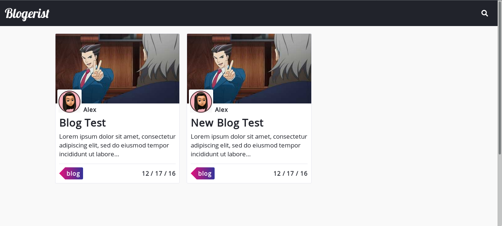

# Blogerist
<p align='center'>
  
</p>

[](https://app.netlify.com/sites/blogerist/deploys)

**Note:** This starter uses [Gatsby v2](https://www.gatsbyjs.org/blog/2018-09-17-gatsby-v2/).

This repo follows the [JAMstack architecture](https://jamstack.org) by using Git as a single source of truth, and [Netlify](https://www.netlify.com) for continuous deployment, and CDN distribution.

## Features

- A simple landing page with blog functionality built with Netlify CMS
- Create Blog posts from Netlify CMS
- Uses SCSS for styling
- Blazing fast loading times thanks to pre-rendered HTML and automatic chunk loading of JS files
- Uses `gatbsy-image` with Netlify-CMS preview support
- Separate components for everything
- Netlify deploy configuration
- Netlify forms functionality
- Discus commenting added to each blog post
- Perfect score on Lighthouse for SEO, Accessibility and Performance
- ..and more

## Prerequisites

- [Node](https://nodejs.org/en/docs/) (Recommend using v12.10.0 or higher)
- [Yarn](https://yarnpkg.com/en/docs) (Recommend using v1.17.3 or higher)
- [Gatsby CLI](https://www.gatsbyjs.org/docs/) (Recommend using v2.7.50 or higher)

## Access Locally
```
$ git clone https://github.com/bvlktech/Blogist.git
$ cd Blogist
$ yarn
$ yarn start
```

This will install all the required dependencies as well as start the development server which you can view in the browser by going to [http://localhost:8000](http://localhost:8000). The page will automatically reload if you make changes to the code. You will see any build errors and lint warnings in the console as shown below.

<p align='center'>
  
</p>

## Setting up the CMS
Follow the [Netlify CMS Quick Start Guide](https://www.netlifycms.org/docs/quick-start/#authentication) to set up authentication, and hosting.

## Debugging
Windows users might encounter ```node-gyp``` errors when trying to npm install.
To resolve, make sure that you have both Python 2.7 and the Visual C++ build environment installed.
```
npm config set python python2.7
npm install --global --production windows-build-tools
```

[Full details here](https://www.npmjs.com/package/node-gyp 'NPM node-gyp page')

If having trouble deploying to Netlify under the Netlify config section under build scripts add `npm i yarn && yarn && yarn build` and then go back to deploys and clear cache and deploy and the site should be deployed.

## Contributing

Contributions are always welcome, no matter how large or small. just make a PR(:
